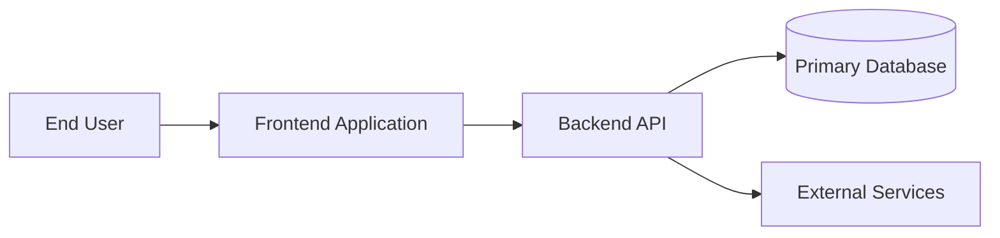
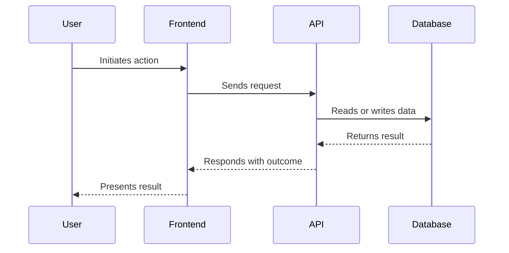
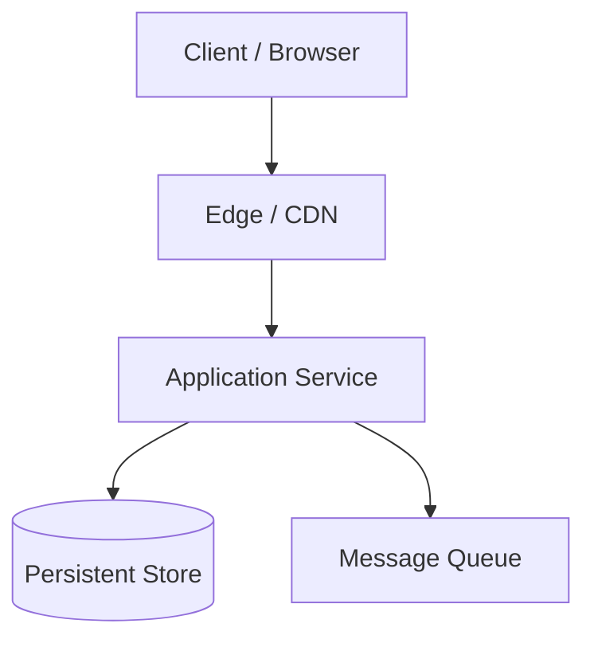

# Architecture

## Overview

- System purpose:
- Primary systems involved:
- Architectural style:
- Design intent:

## System context

- Users:
- Platforms:
- External services:
- Core workflows:

## Context diagram

## Runtime sequence

## Technical stack

- Frontend:
- Backend:
- Database:
- Hosting:
- Auth:
- Messaging/queue:
- Observability:

## Components and boundaries

| Component | Responsibility | Dependencies | Notes |
| --------- | -------------- | ------------ | ----- |
| ...       | ...            | ...          | ...   |

## Data flow

| Flow | Trigger | Reads | Writes | Notes |
| ---- | ------- | ----- | ------ | ----- |
| ...  | ...     | ...   | ...    | ...   |

## Deployment view

## APIs and interfaces

- REST or GraphQL endpoints:
- Webhooks:
- Event contracts:
- Integration points:

## Data model

- Core entities:
- Relationships:
- Important fields:
- Data lifecycle:

## Deployment and operations

- Environment strategy:
- CI/CD approach:
- Monitoring and logging:
- Backups and recovery:
- Rollout plan:

## Decisions, risks, and tradeoffs

- Key decision:
- Tradeoff:
- Risk:
- Open question:
