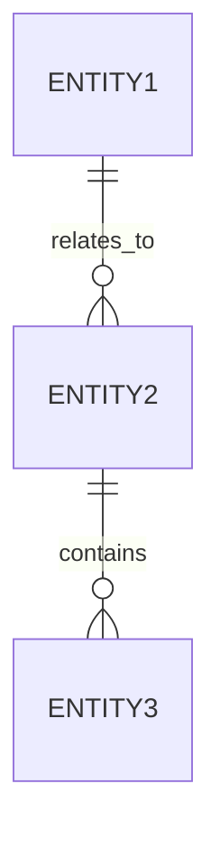

# Schema

## Data overview

- Primary domain objects:
- Storage approach:
- Data ownership:
- Data lifecycle:

## Entities

| Entity | Purpose | Key fields | Constraints | Retention |
| ------ | ------- | ---------- | ----------- | --------- |
| ...    | ...     | ...        | ...         | ...       |

## Relationships

| From | To  | Relationship | Cardinality | Notes |
| ---- | --- | ------------ | ----------- | ----- |
| ...  | ... | ...          | ...         | ...   |

## Validation and invariants

- Required fields:
- Unique constraints:
- Referential integrity:
- Business rules:

## Data contracts

- Input payloads:
- Output payloads:
- Default values:
- Backward compatibility:

## Relationship diagram

## Storage and retention

- Database or storage choice:
- Retention policy:
- Backup or archival needs:

## Risks and open questions

- Data quality concern:
- Migration concern:
- Open question:
